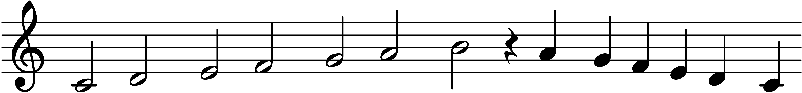

# Requirements

OCaml, ocamlbuild, ocamllex and Menhir.

# Build

```shell
$ make
```

# Run

Now we can generate some .wav-file.

For example, the following code:

```
𝄞 0𝅗𝅥 0½𝅗𝅥 1𝅗𝅥 1½𝅗𝅥 2𝅗𝅥 2½𝅗𝅥 3𝅗𝅥 𝄽 2½♩ 2♩ 1½♩ 1♩ 0½♩ 0♩ ·
```

Corresponds to the following notes:



In `0½𝅗𝅥`:

* Number denotes position on the stave: `1` is first line, `1½` is space between first line and second line, `2` is second line etc.

* Symbol denotes note value.

To compile it, we first need to save it:

```shell
$ echo "𝄞 0𝅗𝅥 0½𝅗𝅥 1𝅗𝅥 1½𝅗𝅥 2𝅗𝅥 2½𝅗𝅥 3𝅗𝅥 3½𝅗𝅥 𝄽 3♩ 2½♩ 2♩ 1½♩ 1♩ 0½♩ 0♩ ·" > abc.synth
```

Then run `synth`:

```shell
$ ./synth.native abc.synth -o abc.wav
```

You can find more examples in the `examples/` directory.